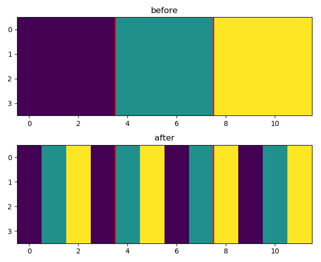

# shuffleNet-cifar10
a pytorch implement of shuffleNet on cifar-10

### channel shuffle

* channel shuffle is a operation proposed in [shuffleNet](https://arxiv.org/abs/1707.01083) to adress the information isolation between channels while using successive group convolution.

* It can be done using only several lines code

  ```python
  # channel shuffle
  n, c, w, h = x.shape
  x = x.view(n, self.g, self.n, w, h)
  x = x.transpose_(1, 2).contiguous()
  x = x.view(n, c, w, h)
  ```

* there is a demo picture to show what happened when channel shuffle

  

### training on cifar10 

* To make it suit cifar10's image size, I have disabled some downsample operation (i.e. maxpooling or stride = 2) and just keep the last two

* because of the low efficiency of group convolution, it takes relatively long time to train, more details can be seen below

  | scale factor | groups | params/M | flops/M | training time | accuracy |
  | :----------: | :----: | :------: | :-----: | :-----------: | :------: |
  |     1.0      |   8    |  0.9131  | 161.70  |     11.4h     |  92.29%  |
  |     0.5      |   8    |  0.2507  |  43.43  |     6.5h      |  91.48%  |
  |     0.5      |   3    |  0.2427  |  42.97  |     4.0h      |  92.60%  |
  |     0.5      |   1    |  0.2487  |  44.63  |     3.6h      |  91.44%  |

  * here the *accuracy* means the max accuracy on validation set

  * *training time* is measured on a titan x (pascal) GPU

  * the results is comparable with resnet 20 which have the similar number of parameters:

    > [resnet 20][https://arxiv.org/abs/1512.03385]	params: 0.27M	 accuracy: 91.25%

* more logs and the best weights can be get in folder `bak` 

### dependency

* pytorch 0.4.0
* python 3.x